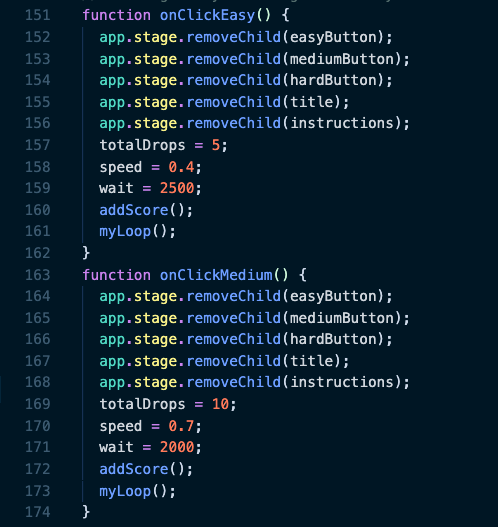
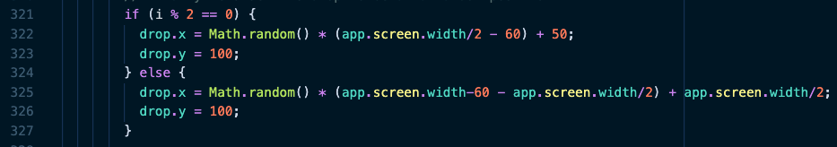

# Raindrops

[Raindrops Live Site](https://raindrops-game.herokuapp.com/)

Raindrops is a speed-typing game designed to improve typing speed through practice. As the words in raindrops fall, type them out before they break the dam!

Raindrops was built with:
- JavaScript
- Node.js
- Express.js
- PixiJS

## Gameplay

### Losing
The game begins with a dam at the bottom of the screen consisting of five logs. If a raindrop reaches the dam before the word is completely typed, a log is dislodged. Once all logs are dislodged, the game is over.

To implement this, the game begins with five lives. Once a raindrop falls below a coordinate near the bottom of the screen, the drop is removed, a log is removed, and the lives counter is decremented. Once zero lives are remaining, all logs and drops are removed.

### Winning
When a word is typed, the typed letters are denoted in red. Once a word is completed, the raindrop evaporates. The game is won once all words have been typed.

Identifying which word the user is attempting to type involves looping through an array of words currently on the screen. When a keypress is identified, the words are iterated through in order of appearance until a match is found. Once a matching first letter is found, the process is repeated to match a keypress to the first two letters, then three, and so on. Once an entire word is matched, the drop is removed and the current matches are reset. 

## Challenges

### Difficulty Levels
There are three difficulty levels for gameplay- easy, medium, and difficult. With a higher difficulty level, the number of total raindrops, their falling speed, and the frequency at which they appear all increase.

One challenge was identifying the "sweet spot" where the drops fall quickly enough so they are not obstructed by new drops. This required some iterative testing at each difficulty level to ensure that the raindrop falls below a certain coordinate point before more drops appear.

### Random Raindrop Placement
Raindrops can appear on the screen one or two at a time. Since the location they appear is always on the same y-axis but at a random x-axis, there could be instances where two drops appear too close to each other. To slightly reduce the randomness and ensure that two drops will never appear directly on top of one another, when there are two drops appearing at once, the screen is divided in half and each drop is randomly placed on each side.

